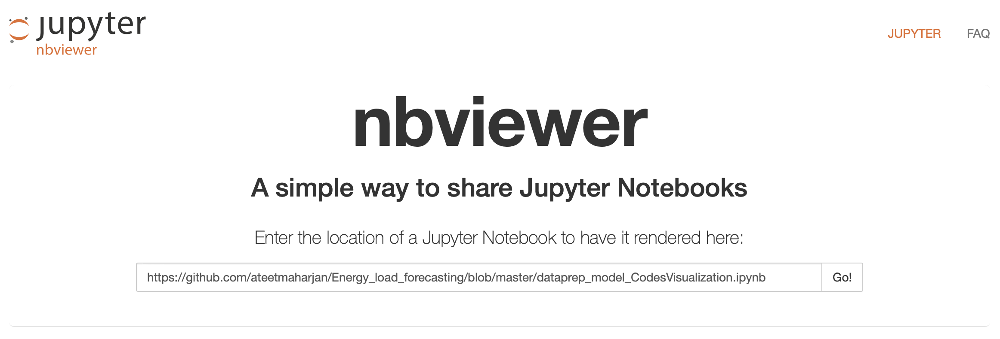
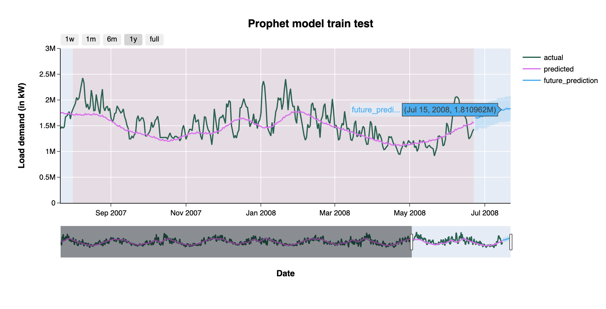

# Energy Forecasting

## Before you start

**1. To see the interactive visualization**, <br>
Go to https://nbviewer.jupyter.org and paste the link of jupyter notebook file https://github.com/ateetmaharjan/Energy_forecasting/blob/master/Code_dataprep_model_visualization.ipynb



**2. If you want to interact with the codes and play with it,** <br>
Go to https://mybinder.org, copy the link of repository https://github.com/ateetmaharjan/Energy_forecasting in the respective GitHub link box, and push launch. It will take a minute to load.

Or, directly go to this [link](https://gesis.mybinder.org/binder/v2/gh/ateetmaharjan/Energy_forecasting/d176da18fe8a5ae882a269632fa1f1677ace87be) (codes may not have been updated). You will be able to use the codes instantly with all files. No installation required.



> Also, check out a demo of an app based on the energy data. However, they need to be changed with the updated forecast.

- https://public.tableau.com/profile/ateetmaharjan#!/vizhome/energyapp/App

- https://energy-load.herokuapp.com/

## Background

As electricity cannot currently be stored in large amounts, supply and demand must always be matched or balanced by system operators. That is why accurate energy demand forecasting plays
a crucial role in this. The liberalization of the electricity industry and the introduction of competition in recent decades has introduced wholesale electricity markets where suppliers, generators, and traders buy and sell
energy. Electricity retailers, investment banks, and large energy users trade large
quantities of electricity and make deals that cover timescales ranging from several
years to on-the-day spot trading. The short term electrical load forecasting is critical in ensuring reliability and operational
efficiency for electrical systems. With an influx of monitoring data and the growing technical
complexity of the grid, there is a great interest and need for accurate forecasting in electricity
planning.

The capstone project involves a hierarchical forecasting problem of electrical loads. You are
required to predict hourly loads (in kW) for a US utility company in 15 different geographical
regions. Electricity demand is subject to factors such as weather conditions, calendar
effects, economic activity, and electricity prices. However, only historical energy loads are taken into account for this project.

In the current project, a subset of data is taken to develop a time series forecasting model and predict electrical loads as the output for a zone.

## Dataset

The original dataset contains hourly load measurements for 15 geographic sub-areas (e.g., residential
and industrial zones) from January 2004 to June 2008. Also, 8 weeks below in the load history were missing and required to be "backcasted". The electrical loads for each of the eight missing weeks
in the past were "backcasted" (in the previous project), and the current project contains a full dataset.

- 2005/3/6 ~ 2005/3/12
- 2005/6/20 ~ 2005/6/26
- 2005/9/10 ~ 2005/9/16
- 2005/12/25 ~ 2005/12/31
- 2006/2/13 ~ 2006/2/19
- 2006/5/25 ~ 2006/5/31
- 2006/8/2 ~ 2006/8/8
- 2006/11/22 ~ 2006/11/28

## Predictive Modeling

"Forecasting" is the process of exploring the future events that have not been observed or
determined. On the other hand, "backcasting" typically refers to exploring the past
events given the information known to date.

Objective: To "forecast" the energy consumption for
the upcoming days (15 days/ a month).

## Backcasting History

Dataset was inverted (based on date) and partitioned into 70% - 30% training and test dataset. The complete data up until the missing week was used to forecast missing week using time series models like ARIMA, simple exponential smoothing, Holt's Linear Trend, and Holt's Winter were used to predict the missing week. Once the week was forecasted, the dataset was appended and used to forecast the next missing week until there were no missing values. The loop considered each region independently at the hour level i.e., each hour of the day was forecasted separately from the others to help predict high and low points in load throughout the day.

Models included ARIMA, simple exponential smoothing, Holt's Linear Trend, and Holt's Winter and were selected based on the lowest RMSE (root mean square error). Once we had backcasts for all the missing data, the data was then reordered back to its original form.

## Forecasting Electrical Loads

The prophet model from Facebook was used to forecast. <br>For further information:
https://facebook.github.io/prophet/

### Model Optimization

> Do not run loop randomly
> Do not include holidays for hourly data (Non-daily data)
> Changepoints are the points in your data where there are
> Sudden and abrupt changes in the trend. Let Prophet discover changepoints on its own and tweak the number of
> Changepoints (with n_changepoints) as required (read documents before you do)

### Seasonality

> seasonality_mode: This parameter indicates how your seasonality components should be integrated with the predictions. <B>ADDITIVE:</B> if seasonality trend is constant over entire period. <B>MULTIPLICATIVE:</B> to increase the importance of the seasonalities over time
> if the rate of change is much quicker than in the early years

> seasonality_prior_scale: 10-25 works well, depending on seasonality in components plot

> Initially, set yearly_seasonality, weekly_seasonality and daily_seasonality to False. Later, adding seasonalities with chosen parameters gives more power over seasonality.

> Period = 35 --> what happened will repeat in 35 period interval

> fourier_order: try 10-25 <br>
> Represents the number of Fourier components each seasonality is composed of.

### Default model and fitting to data frame df

model = Prophet()

model.fit(df)

### Check EDA for trend and seasonality and tweak parameters

```from fbprophet import Prophet
model = Prophet(
    growth='linear',
    holidays=holidays,
    seasonality_mode='additive',
    changepoint_prior_scale=30,
    seasonality_prior_scale=15,
    holidays_prior_scale=20,
    daily_seasonality=False,
    weekly_seasonality=False,
    yearly_seasonality=False
    ).add_seasonality(name="monthly", period=30.5, fourier_order=55
    ).add_seasonality(name="daily", period=1,fourier_order=15
    ).add_seasonality(name="weekly", period=7,fourier_order=20
    ).add_seasonality(name="yearly", period=365.25,fourier_order=20
    ).add_seasonality(name="quarterly", period=365.25/4,
                      fourier_order=5, prior_scale=15
    )
`"

### What can you do to improve forecasting?

- Only historical data for energy load has been used. The inclusion of other factors, such as temperature, will improve the error.
- Retweak parameters in the fbprophet model.
- Cross-Validation
- Combining multiple forecasts
- Dynamic Time-series considering 2008's The Great Recession.
```
